# Heliboard-themes

Custom HeliBoard/LeanType keyboard themes - Catppuccin, Rose Piné, Cyberpunk, Neon, E-Ink, Anime, and more (because the default ones weren't enough)

A collection of custom themes for [LeanType](https://github.com/LeanBitLab/HeliboardL) and [HeliBoard](https://github.com/Helium314/HeliBoard) - made because I couldn't find themes that felt right.

Multiple themes ranging from minimal to chaotic. Dark, light, pastel, neon. All handcrafted. All have gesture trails. And pop-up keys colored. And much more.
**Added 5 more themes in June Release (Total 16)**
All themes have customized gestured trails even if I have not shared the specific screenshots.

---

## Themes

### April Updates

| Theme                                                 | Preview                                                                                                   | Style                                                                                                                                                                         |
| ----------------------------------------------------- | --------------------------------------------------------------------------------------------------------- | ----------------------------------------------------------------------------------------------------------------------------------------------------------------------------- |
| **[After Colony](themes/AfterColony.json)**           |  .jpg>) | A fun Anime (Gundam Wing) keyboard. If you want to use your own backgrounds, use this theme. Just dim/overlay your own bg by 35%-50%, and add it to this theme from your app. |
| **[After Colony Zero](themes/AfterColonyZero.json)**  |                                                         | Pure black background, white keys, magenta/pink number accents, cyan globe and delete button, purple search button.  The contrast is immaculate.                           |
| **[Cyber Neony](themes/CyberNeony.json)**             | 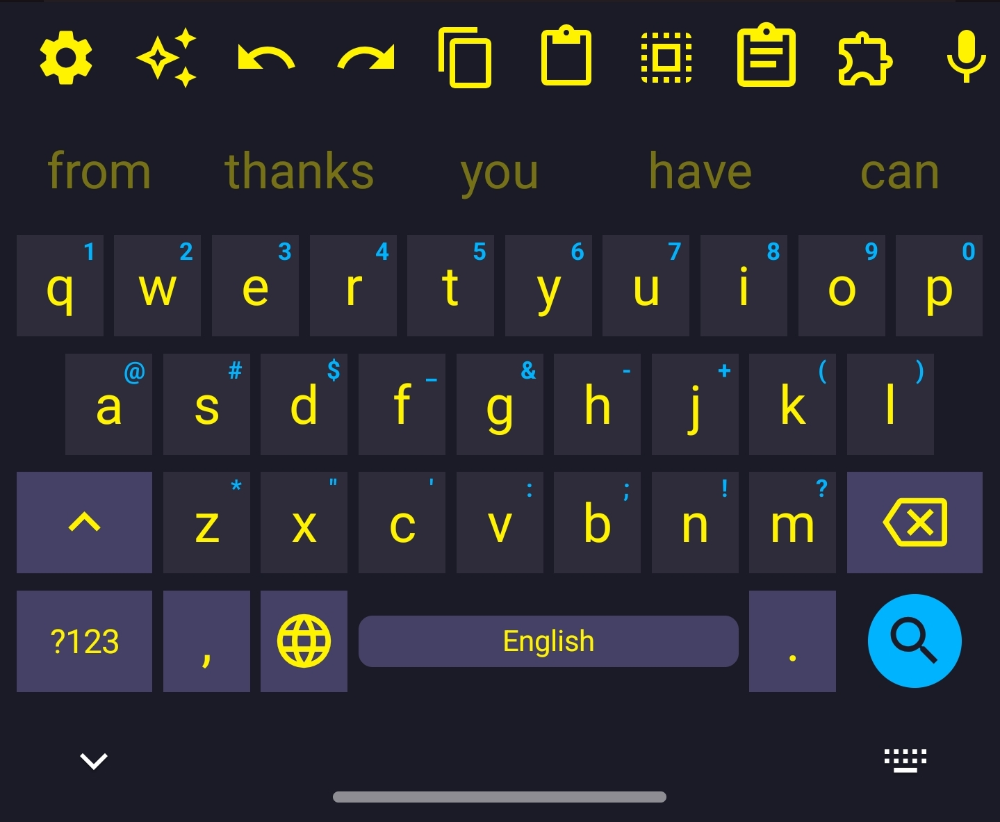                                                                   | Dark navy, full neon yellow keys, cyan search button — bold and it works                                                                                                      |
| **[PLN](themes/PLN.json)**                            |                                                                                   | Personal Nord variant — steel blue, warm and less clinical than stock Nord                                                                                                    |
| **[Catppuccin Frappe](themes/CatppuccinFrappe.json)** | 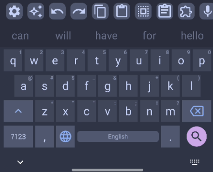                                                       | Muted blue-grey, mauve search button, faithful to the Catppuccin palette                                                                                                      |
| **[Mellow Dark](themes/MellowDark.json)**             | 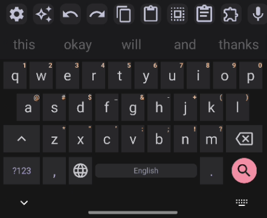                                                                   | Near-black with warm undertones, pink search button, very clean                                                                                                               |
| **[Vesnea Dark](themes/VesneaDark.json)**             | 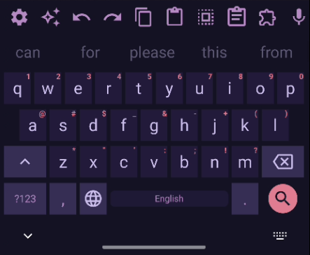                                                                   | Deep purple-navy, barely-visible pink number accents, night-mode friendly                                                                                                     |
| **[Vesnea Muted](themes/VesneaMuted.json)**           | 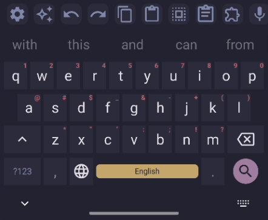                                                                 | Muted Vesnea variant with adjusted contrast                                                                                                                                   |
| **[Vesnea Light](themes/VesneaLight.json)**           | 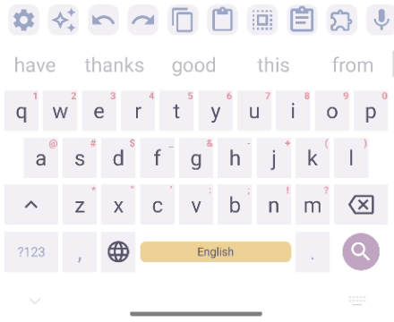                                                                 | Light Vesnea — warm sandy spacebar, soft and charming                                                                                                                         |
| **[Iridium Light](themes/IridiumLight.json)**         | 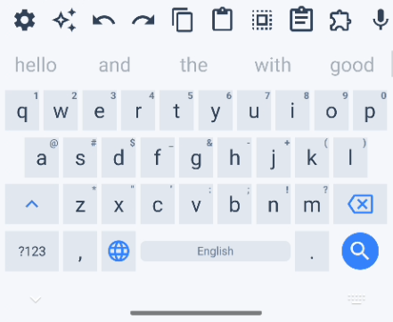                                                               | Pure minimal grey — disappears while you type                                                                                                                                 |
| **[Wth](themes/Wth.json)**                            |                                                                                   | Dark navy, neon cyan keys, magenta accents, hot pink toolbar                                                                                                                  |

### June Updates

| Theme                                          | Preview                                                                                                      | Style                                                                                       |
| ---------------------------------------------- | ------------------------------------------------------------------------------------------------------------ | ------------------------------------------------------------------------------------------- |
| **[Rose Piné Main](themes/RosePineMain.json)** | 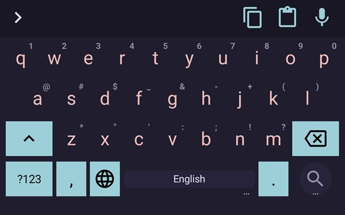                                                                 | High-contrast dark mode with deep, cool undertones and soft purple accents                  |
| **[Rose Piné Dawn](themes/RosePineDawn.json)** | 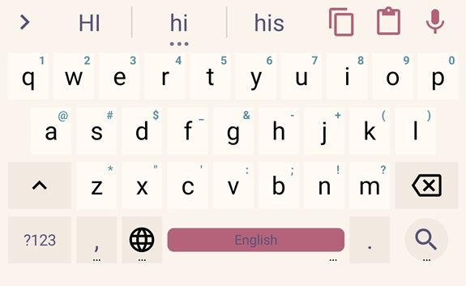.jpg>) | Warm, beige-based light theme that avoids harsh pure-white backgrounds                      |
| **[Rose Piné Moon](themes/RosePineMoon.json)** | 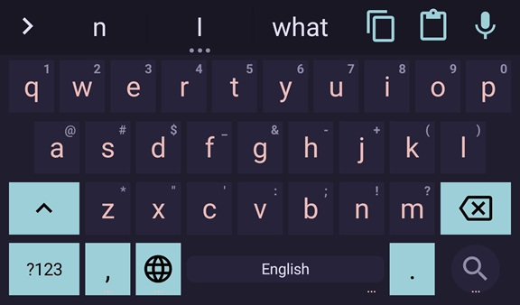                                                                 | A washed-out, twilight dark theme with reduced contrast and muted pastel accents            |
| **[E-Ink Black](themes/EinkBlack.json)**       | 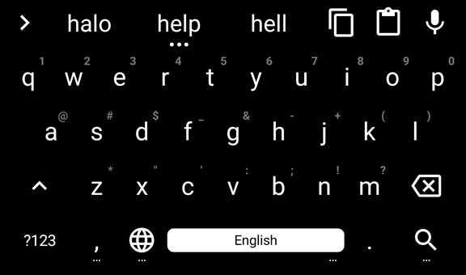                                                                       | Absolute OLED black with stark white text, designed for maximum contrast and zero dithering |
| **[E-Ink White](themes/EinkWhite.json)**       | 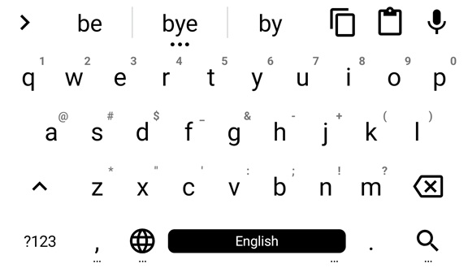                                                                       | Pure white background with hard black text and keys, optimized to prevent e-ink ghosting    |

---

## How to Install

1. Download the `.json` file for the theme you want from the `themes/` folder
   - Alternately, go to [releases](https://github.com/Star-Trowa/heliboard-themes/releases) and download the zip files containing the bundled theme jsons
2. Open **LeanType** or **HeliBoard** on your Android device
3. Go to **Settings → Appearance → Themes**
4. Tap the **import/load** button and select the downloaded `.json` file
5. Apply the theme

_Optional:_ Add a wallpaper to your keyboard (After Colony & After Colony Zero themes work best for this).

- Here's a sample:

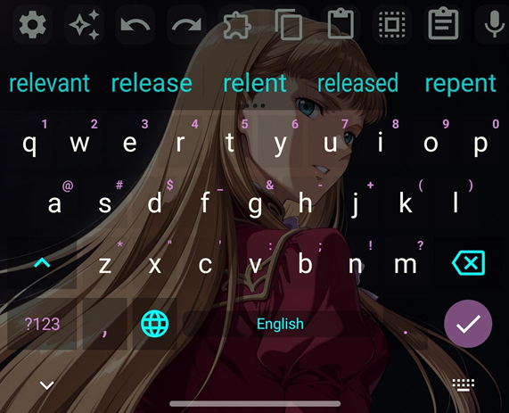

> Themes work well with both LeanType (HeliboardL fork) and HeliBoard.

**Compatible with versions upto:**

LeanType v3.8.5 & HeliBoard v3.9 (Tested with versions 3.8.5 & 3.9)

Eink versions work well but some elements cannot be customized via themes like shadows/gesture trails. These are keyboard limitations

---

## License

Copyright (C) 2026 Star-Trowa

This program is free software: you can redistribute it and/or modify
it under the terms of the GNU General Public License as published by
the Free Software Foundation, either version 3 of the License, or
(at your option) any later version.

This program is distributed in the hope that it will be useful,
but WITHOUT ANY WARRANTY; without even the implied warranty of
MERCHANTABILITY or FITNESS FOR A PARTICULAR PURPOSE. See the
GNU General Public License for more details.

You should have received a copy of the GNU General Public License
along with this program. If not, see <https://www.gnu.org/licenses/>.

---

## Credits

- [LeanType / HeliboardL](https://github.com/LeanBitLab/HeliboardL) & [HeliBoard](https://github.com/Helium314/HeliBoard) - The keyboards these are built for
- PLN theme inspired by [PipeItToDevNull/PLN](https://github.com/PipeItToDevNull/PLN) Nord variant
- Catppuccin palette from [catppuccin.com](https://catppuccin.com)
- Vesnea palettes somewhat inspired from [vesnea-theme.com](https://github.com/seavalanche/vesnea-obsidian-theme)
- Gundam Wing [Wallpaper](https://i.pximg.net/img-master/img/2025/10/19/18/02/28/136462395_p0_master1200.jpg) by [スワぽん](https://www.pixiv.net/en/users/15476858)
- Rose Piné Palette from [Rose Piné Theme](https://rosepinetheme.com/palette)

**Check out my other [projects](https://github.com/Star-Trowa) if you're interested.**

---

## Support

If my themes made your keyboard a little nicer, consider supporting my work:

- **GitHub Sponsors:** [Sponsor @Star-Trowa](https://github.com/sponsors/Star-Trowa)
- **Ko-fi:** [ko-fi.com/Star_Trowa](https://ko-fi.com/star_trowa)
- 

    
<b>Click to show UPI QR Code (India)</b>

    
  

### Requests

Have a specific color palette or wallpaper in mind? For any other app besides these two keyboards? **I am actively taking custom theme requests!** Feel free to open an Issue with your idea. If you enjoy my work or want to bump your custom request to the top of my queue, consider supporting the project.
