# heliboard-themes
Custom HeliBoard/LeanType keyboard themes - Catppuccin, Rose Piné, Cyberpunk, Neon, and more (because the default ones weren't enough)


A collection of custom themes for [LeanType](https://github.com/LeanBitLab/HeliboardL) and [HeliBoard](https://github.com/Helium314/HeliBoard) - made because I couldn't find themes that felt right.

12 themes ranging from minimal to chaotic. Dark, light, pastel, neon. All handcrafted. All have gesture trails. And pop-up keys colored. And much more.

---

## Themes

| Theme                      | Preview                                                        | Style                                                                      |
| -------------------------- | -------------------------------------------------------------- | -------------------------------------------------------------------------- |
| **After Colony**           | 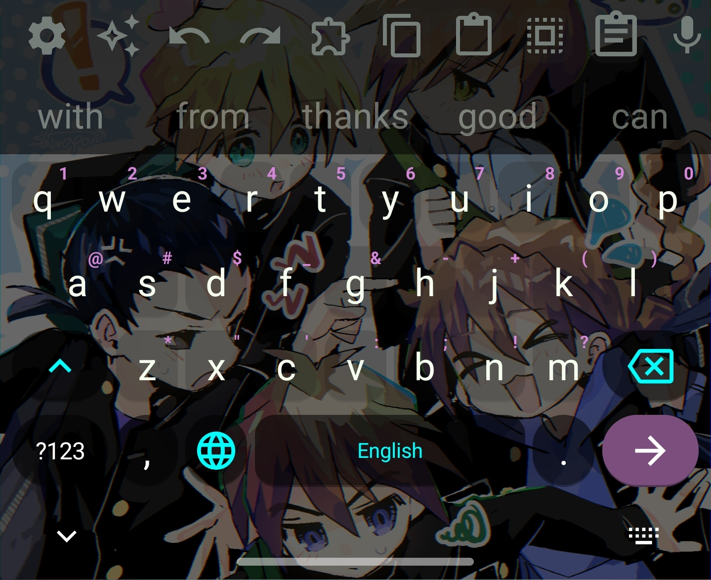<br>.jpg) | A fun Anime (Gundam Wing) keyboard. If you want to use your own backgrounds, use this theme. Just dim/overlay your own bg by 35%-50%, and add it to this theme from your app.                                                                                                     |
| **AfterColonyZero**            | 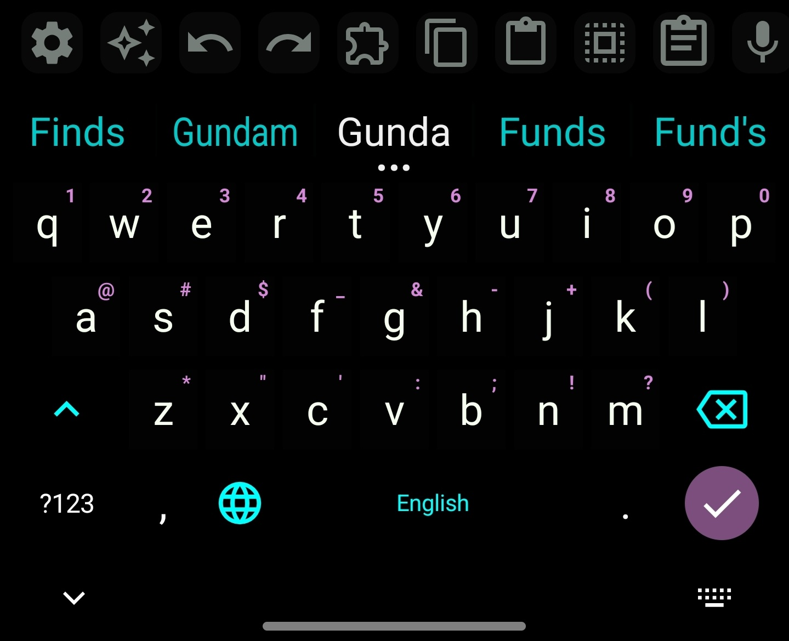                                                       | Pure black background, white keys, magenta/pink number accents, cyan globe and delete button, purple search button. <br>The contrast is immaculate.   |
| **Cyber Neony**         | 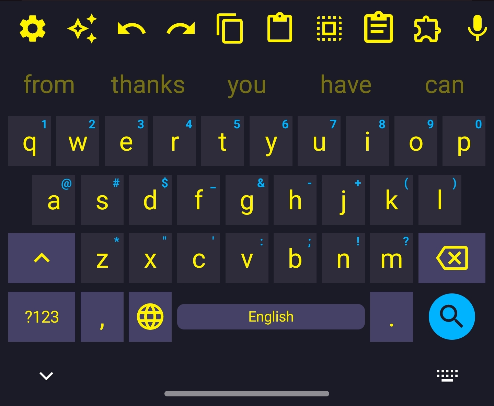                 | Dark navy, full neon yellow keys, cyan search button — bold and it works              |
| **PLN**                    | 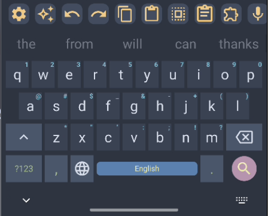                                       | Personal Nord variant — steel blue, warm and less clinical than stock Nord |
| **My Mild Purple**         | 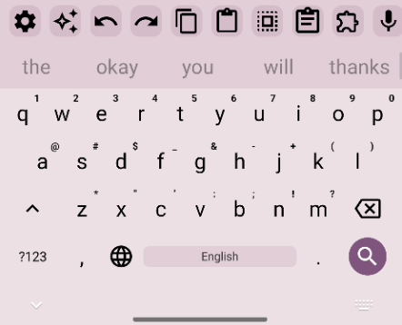                 | Light base with lavender accent keys and purple bottom row                 |
| **Catppuccin Frappe**      | 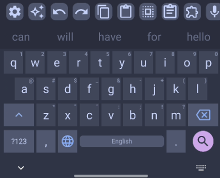            | Muted blue-grey, mauve search button, faithful to the Catppuccin palette   |
| **Dark Mellow**            | 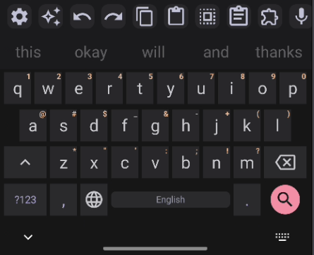                        | Near-black with warm undertones, pink search button, very clean            |
| **Dark Vesnea**            | 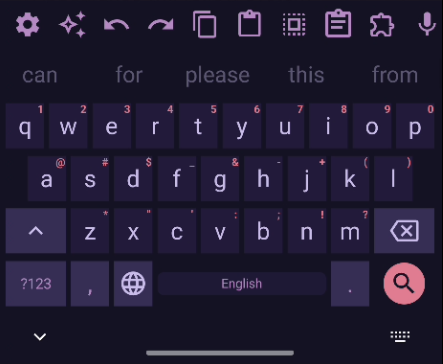                        | Deep purple-navy, barely-visible pink number accents, night-mode friendly  |
| **Vesnea D**               | 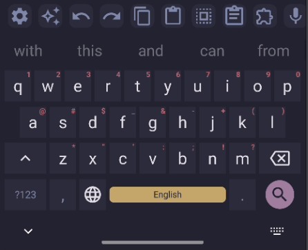                             | Dark Vesnea variant with adjusted contrast                                 |
| **Vesnea L**               | 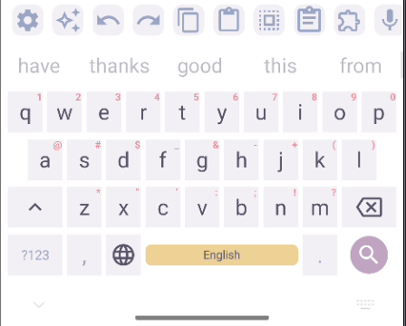                             | Light Vesnea — warm sandy spacebar, soft and charming                      |
| **Iridium Light**          | .png)                  | Pure minimal grey — disappears while you type                              |
| **wth**                    | 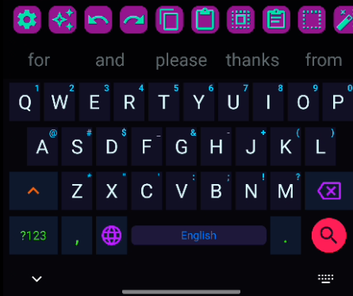                                       | Dark navy, neon cyan keys, magenta accents, hot pink toolbar  |


---

## How to Install

1. Download the `.json` file for the theme you want from the `themes/` folder
2. Open **LeanType** or **HeliBoard** on your Android device
3. Go to **Settings → Appearance → Themes**
4. Tap the **import/load** button and select the downloaded `.json` file
5. Apply the theme

> Themes are built for LeanType (HeliboardL fork) but should work with HeliBoard as well.

---

## Repo Structure

```
star-keyboard-themes/
├── themes/          -- JSON theme files (import these)
├── previews/        -- Screenshot previews
└── README.md
```

---

## Credits

- [LeanType / HeliboardL](https://github.com/LeanBitLab/HeliboardL) — the keyboard fork these are built for
- [HeliBoard](https://github.com/Helium314/HeliBoard) — the base keyboard
- PLN theme inspired by [PipeItToDevNull/PLN](https://github.com/PipeItToDevNull/PLN) Nord variant
- Catppuccin palette from [catppuccin.com](https://catppuccin.com)
- Vesnea palettes somewhat inspired from [vesnea-theme.com](https://github.com/seavalanche/vesnea-obsidian-theme)
- Gundam Wing [Wallpaper](https://i.pximg.net/img-master/img/2025/10/19/18/02/28/136462395_p0_master1200.jpg) by [スワぽん](https://www.pixiv.net/en/users/15476858)


---

## Support

If my themes made your keyboard a little nicer:

- Ko-fi: [ko.fi/StarTrowa](https://ko.fi/Star_Trowa)
- UPI: `yourname@bank` (This section is sample for now; leave a comment, please, if you would like  to use it ^-^)

